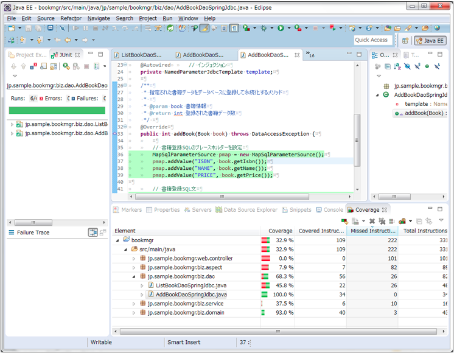

# Spring Framework 入門
### STEP 09 / テストコードの書き方を覚えよう！
##### STEP 09-2 / Webアプリケーション全体をテストしてみる
今回は、模擬的なHTTPリクエストを発行して、作成したWebアプリケーション全体、つまり Controller - Service - Dao を一気通貫に動作させてテストする方法を学習します。総合テストやシナリオテストに応用可能な手法です。
***

## 1. テストカバレッジを可視化しよう
#### 1-1. テストのカバレッジを可視化するツール EclEmma を導入
###### 1-1-1. EclEmma（Eclipse Plugin）導入
```
EclEmma インストール

  [Help]→[Eclipse MarketPlace]
  検索画面で "EclEmma" を検索し以下のツールをインストールする。
  -----------------
  EclEmma Java Code Coverage 2.3.3
  -----------------

  プラグインは全て選択してインストール→[再起動]
```

###### 1-1-2. EclEmma でカバレッジリポートを出力する対象を設定する
```
1.カバレッジコンフィグレーション画面を出す。
  Package Explorerでプロジェクト[bookMgr]選択し右クリック→[Coverage As]→[Coverage Configurations]..

2.カバレッジレポート対象範囲を設定
  [Coverage]タブを選択すると候補となるスコープ（フォルダやライブラリ）一覧が表示される。
  今回の対象は[bookMgr–src/main/java]なので、そこだけにチェックを入れた状態で[Apply]する。
```

###### 1-1-3. テストコードを実行してカバレッジリポートを出力する
```
1.プロジェクト内のテストケースを一気に実行してカバレッジレポートを出力する。
  - Package Explorerでプロジェクト[bookMgr]を選択して右クリック→[Coverage As]→[JUnit Test]
  - EclipseのJUnitビューが表示され、プロジェクト内のテストケースが全て実行される

2.テストケース実行結果確認
  - 全てのテストが完了するとその結果が表示される

3.カバレッジレポートを確認する
  - EclipseのCoverageビューが表示される。このビューでカバレッジが確認できる。
```

EclEmma カバレージリポートの画面イメージ


## 2. 正常系のテストコードを書いてみる
#### 2-1. メイン画面の正常系テストケース作成
###### 2-1-1. /src/test/java/jp.sample.bookmgr.web.controller.MainControllerTest.java を新規作成
★★テストコードは、"/src/test" の配下に保存する必要があります。引き続き注意してください。

```
/src/test/java で右クリック→[New]→[Class]（もしくは[jUnitTestCase]）

---------------
Java Class 画面
---------------
 [Package]: "jp.sample.bookmgr.web.controller"
 [Name]:    "MainControllerTest" と入力して[Finish]
---------------
テストケースのひな形が自動作成される
```

###### 2-1-2. /src/test/java/jp.sample.bookmgr.web.controller.MainControllerTest.java コーディング
```java
package jp.sample.bookmgr.web.controller;

import static org.springframework.test.web.servlet.setup.MockMvcBuilders.*;	
import static org.springframework.test.web.servlet.result.MockMvcResultMatchers.*;
import static org.springframework.test.web.servlet.request.MockMvcRequestBuilders.*;

import org.junit.Before;
import org.junit.Test;
import org.junit.runner.RunWith;
import org.springframework.beans.factory.annotation.Autowired;
import org.springframework.test.context.ContextConfiguration;
import org.springframework.test.context.junit4.SpringJUnit4ClassRunner;
import org.springframework.test.context.web.WebAppConfiguration;
import org.springframework.test.web.servlet.MockMvc;
import org.springframework.web.context.WebApplicationContext;

/**
 * Mainコントローラクラスのテストケース
 * 
 * @author 長住@NTT-AT
 * @version 1.0
 */

// SpringによるJunitテストランナー
@RunWith(SpringJUnit4ClassRunner.class)

// WebApplicationContext をロードした環境下でテストコードを実行できるおまじない
@WebAppConfiguration

// Spring定義ファイルの取り込み
@ContextConfiguration({"classpath:test-context-biz.xml", "classpath:test-context-web.xml"})

public class MainControllerTest {

    /**
     * WebApplicationContext
     */
    @Autowired
    private WebApplicationContext wac;

    /**
     * Spring MVCのテストをするためのMockMvcクラス
     */
    private MockMvc mockMvc;

    /**
     * 事前のおまじない
     * MockMvcクラスインスタンスを取得
     */
    @Before
    public void setup() {
        // MockMvcクラスインスタンスを取得
        mockMvc = webAppContextSetup(wac).build();
    }

    /**
     * メイン画面表示処理のテスト
     * 正常系その１
     * GETリクエストを模倣し返って来たHTTPステータスコードとビューの名前をチェック
     */
    @Test
    public void testMain_normal_1() throws Exception {
        
        // メイン画面表示のGETリスクエスト発行
        mockMvc.perform(get("/main"))
            .andExpect(status().isOk())
            .andExpect(view().name("main"));
    }
}
```

###### 2-1-3. メイン画面の正常系テストケースを実行してみる
1. テストケース MainControllerTest を[Run as]→[jUnit]で実行し結果を確認してください。
2. プロジェクト全体を[Run as]→[jUnit]で実行し結果を確認してください。
3. プロジェクト全体を[Coverage as]→[jUnit]で実行しカバレッジを確認してください。

#### 2-2. 書籍一覧画面の正常系テストケース作成
###### 2-2-1. /src/test/java/jp.sample.bookmgr.web.controller.BookControllerTest.java を新規作成
テストケース BookControllerTest クラスを新規作成してください。

###### 2-2-2. /src/test/java/jp.sample.bookmgr.web.controller.BookControllerTest.java コーディング
```java
package jp.sample.bookmgr.web.controller;

import static org.junit.Assert.*;
import static org.springframework.test.web.servlet.request.MockMvcRequestBuilders.*;
import static org.springframework.test.web.servlet.result.MockMvcResultMatchers.*;
import static org.springframework.test.web.servlet.setup.MockMvcBuilders.*;

import java.util.List;

import org.hamcrest.CoreMatchers;
import org.junit.Before;
import org.junit.Test;
import org.junit.runner.RunWith;
import org.springframework.beans.factory.annotation.Autowired;
import org.springframework.test.context.ContextConfiguration;
import org.springframework.test.context.junit4.SpringJUnit4ClassRunner;
import org.springframework.test.context.web.WebAppConfiguration;
import org.springframework.test.web.servlet.MockMvc;
import org.springframework.test.web.servlet.MvcResult;
import org.springframework.test.web.servlet.ResultActions;
import org.springframework.ui.ModelMap;
import org.springframework.web.context.WebApplicationContext;

import jp.sample.bookmgr.biz.domain.Book;

/**
 * Bookコントローラクラスのテストケース
 * 
 * @author 長住@NTT-AT
 * @version 1.0
 */

// SpringによるJunitテストランナー
@RunWith(SpringJUnit4ClassRunner.class)

// WebApplicationContext をロードした環境下でテストコードを実行できるおまじない
@WebAppConfiguration

// Spring定義ファイルの取り込み
@ContextConfiguration({"classpath:test-context-biz.xml", "classpath:test-context-web.xml"})

public class BookControllerTest {

    /**
     * WebApplicationContext
     */
    @Autowired
    private WebApplicationContext wac;

    /**
     * Spring MVCのテストをするためのMockMvcクラス
     */
    private MockMvc mockMvc;
    
    /**
     * 事前のおまじない
     * MockMvcクラスインスタンスを取得
     */
    @Before
    public void setup() {

        // MockMvcクラスインスタンスを取得
        mockMvc = webAppContextSetup(wac).build();
    }
    
    /**
     * 書籍一覧画面表示処理のテスト
     * 正常系その１
     * GETリクエストを模倣し返って来たHTTPステータスコードとビューの名前をチェック
     * DBに規定データが登録されていることを前提にDBから取得したデータが正しいかもチェック
     */
    @SuppressWarnings("unchecked")
    @Test
    public void testListBook_normal_1() throws Exception {
        
        // 書籍一覧表示画面のGETリスクエスト発行
        ResultActions retact = mockMvc.perform(get("/listbook"))
            .andExpect(status().isOk())            // HTTPステータスコード
            .andExpect(view().name("listbook"));        // ビュー名

        // DBから読み込んだ書籍情報リストを取り出す
        MvcResult mvcResult = retact.andReturn();
        ModelMap modelMap = mvcResult.getModelAndView().getModelMap();
        List<Book> booksList = (List<Book>)modelMap.get("books");
        assertThat(booksList, CoreMatchers.is(CoreMatchers.not(CoreMatchers.nullValue())));
        
        // DBに ID=1、ISBN="123456789abcdefgh" NAME="JavaScript" PRICE=1200 
        // のデータが登録されていることが前提のテストケース
        Book book1 = booksList.get(0);
        assertThat(book1.getId(), CoreMatchers.is(1));
        assertThat(book1.getIsbn(), CoreMatchers.is("123456789abcdefgh"));
        assertThat(book1.getName(), CoreMatchers.is("JavaScript"));
        assertThat(book1.getPrice(), CoreMatchers.is(1200));
    }
}
```

###### 2-2-3. 書籍一覧画面の正常系テストケースを実行してみる
1. テストケース BookControllerTest を[Run as]→[jUnit]で実行し結果を確認してください。
2. プロジェクト全体を[Run as]→[jUnit]で実行し結果を確認してください。
3. プロジェクト全体を[Coverage as]→[jUnit]で実行しカバレッジを確認してください。

#### 2-3. 書籍登録処理の正常系テストケース作成
###### 2-3-1. /src/test/java/jp.sample.bookmgr.web.controller.BookControllerTest.java に以下のコードを追加
```java
◆
◆ 省略
◆ -- 93行目付近
◆ ---- ↓ 書籍登録処理の正常系テストケースを追加 ----
◆
    /**
     * 書籍登録処理のテスト
     * 正常系その１
     * 書籍フォームからのPOSTリクエストを模倣し実際にデータベースに登録させる。
     * また、返って来たHTTPステータスコードとビューの名前をチェックする。
     * @throws Exception
     */
    @Test
    public void testAddBook_normal_1() throws Exception {
        
        // テストで登録する書籍情報を設定
        Book book = new Book();
        book.setIsbn("TEST-1234567890");
        book.setName("testAddBookで自動登録しました");
        book.setPrice(8888);

        // 書籍登録POSTリクエスト発行
        mockMvc.perform(post("/addbook")
                .param("isbn", book.getIsbn())
                .param("name", book.getName())
                .param("price", new Integer(book.getPrice()).toString())
                )
            .andExpect(status().isFound())                // HTTPステータスコード
            .andExpect(view().name("redirect:result"))    // ビュー名
            .andExpect(model().hasNoErrors());            // エラーがないこと
    }
◆
◆ ---- ↑ ここまで、書籍登録処理の正常系テストケース ----
◆ 以下省略
◆
```

###### 2-3-2. 書籍登録処理の正常系テストケースを実行してみる
1. テストケース BookControllerTest を[Run as]→[jUnit]で実行し結果を確認してください。
2. プロジェクト全体を[Run as]→[jUnit]で実行し結果を確認してください。
3. プロジェクト全体を[Coverage as]→[jUnit]で実行しカバレッジを確認してください。

## 3. 異常系のテストコードを書いてみる
#### 3-1. 書籍登録処理の正常系テストケース作成
異常系テストケースは、書籍登録処理（フォームデータのPOST処理）を例にとってコーディング方法を学習します。

###### 3-1-1. /src/test/java/jp.sample.bookmgr.web.controller.BookControllerTest.java に異常系コードを追加
```java
◆
◆ 省略
◆ -- 120行目付近
◆ ---- ↓ 書籍登録処理の異常系テストケースを追加 ----
◆
    /**
     * 書籍登録処理のテスト
     * 異常系その１
     * 書籍フォームからのPOSTリクエストを模倣するがバリデーションエラーとなるケース。
     * 返って来たHTTPステータスコードとビューの名前をチェックする。
     * @throws Exception
     */
    @Test
    public void testAddBook_abnormal_1() throws Exception {
        
        // テストで登録する書籍情報を設定
        Book book = new Book();
        book.setIsbn("1234");    ★★★ --- @Size 違反 ★★★
        book.setName("testAddBookで自動登録しました");
        book.setPrice(8888);

        // 書籍登録POSTリクエスト発行
        mockMvc.perform(post("/addbook")
                .param("isbn", book.getIsbn())
                .param("name", book.getName())
                .param("price", new Integer(book.getPrice()).toString())
                )
            .andExpect(status().isOk())                    // HTTPステータスコード
            .andExpect(view().name("addbookform"))         // ビュー名
            .andExpect(model().hasErrors())                // エラーが発生していること
            .andExpect(model().errorCount(1))              // エラーの数
            .andExpect(model().attributeExists("book"))    // modelAtribute名
            .andExpect(model().attributeHasFieldErrors("book", "isbn"))  // エラーフィールド名
            ;
    }
◆
◆ ---- ↑ ここまで、書籍登録処理の異常系テストケース ----
◆ 以下省略
◆
```

###### 3-1-2. 書籍登録処理の異常系テストケースを実行してみる
1. テストケース BookControllerTest を[Run as]→[jUnit]で実行し結果を確認してください。
2. プロジェクト全体を[Run as]→[jUnit]で実行し結果を確認してください。
3. プロジェクト全体を[Coverage as]→[jUnit]で実行しカバレッジを確認してください。
